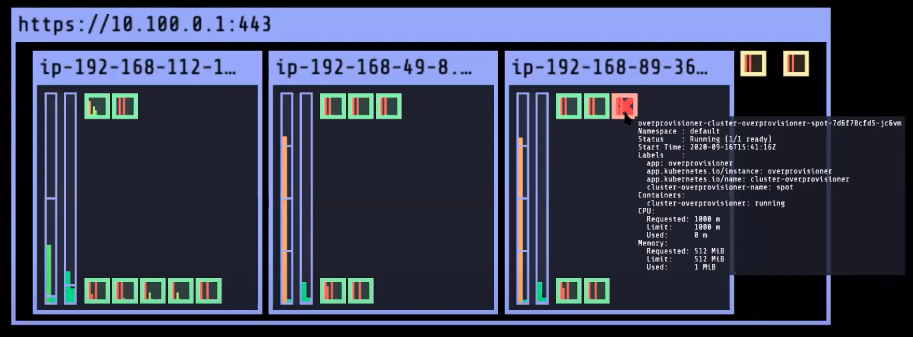

# BRAND NEW Update!

Proactively manage your EC2 Spot instances with EC2 Auto Scaling: https://aws.amazon.com/blogs/compute/proactively-manage-spot-instance-lifecycle-using-the-new-capacity-rebalancing-feature-for-ec2-auto-scaling/

# Learn how to handle mixed Purchase Option Kubernetes clusters 

EC2 Spot Workshop (EKS): https://ec2spotworkshops.com/using_ec2_spot_instances_with_eks.html

Spot Instance Advisor: https://aws.amazon.com/ec2/spot/instance-advisor/

Other best practices (e.g. Overprovisioner): https://aws.github.io/aws-eks-best-practices/cluster-autoscaling/#overprovisioning

# DEMO

Here's a sneak peek of what you'll buiild: 

## Tools
AEMM (Amazon Ec2 Metadata Mock): https://github.com/aws/amazon-ec2-metadata-mock

Overprovisioner Helm chart: https://github.com/helm/charts/tree/master/stable/cluster-overprovisioner

AWS Node termination handler: https://github.com/aws/aws-node-termination-handler

Cloud9: https://aws.amazon.com/cloud9/

## Commands I've used

### Deploy the Overprovisioner
helm upgrade overprovisioner stable/cluster-overprovisioner --values overprovisionervalues.yml 

### Scale pods (showcase how overprovisioning works)
kubectl scale deployment/monte-carlo-pi-service --replicas=6

### Install the node termination handler (substitute the instance-id with your own)
helm install nth-mock eks/aws-node-termination-handler -n kube-system -f single-node-terminationhandler-values.yaml

### to uninstall
helm uninstall nth-mock eks/aws-node-termination-handler -n kube-system 

### Work with the AEMM and show how the termination handler works (substitute the instance-id with your own)
helm install amazon-ec2-metadata-mock amazon-ec2-metadata-mock-1.6.0.tgz -f metadata-mock-values.yaml

### to uninstall
helm uninstall amazon-ec2-metadata-mock amazon-ec2-metadata-mock-1.6.0.tgz
